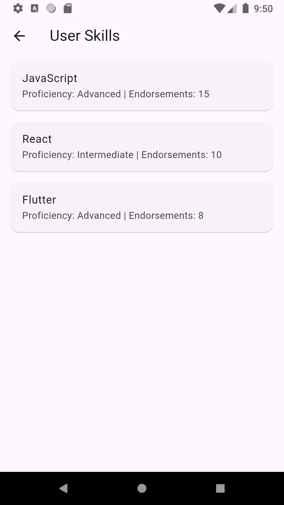
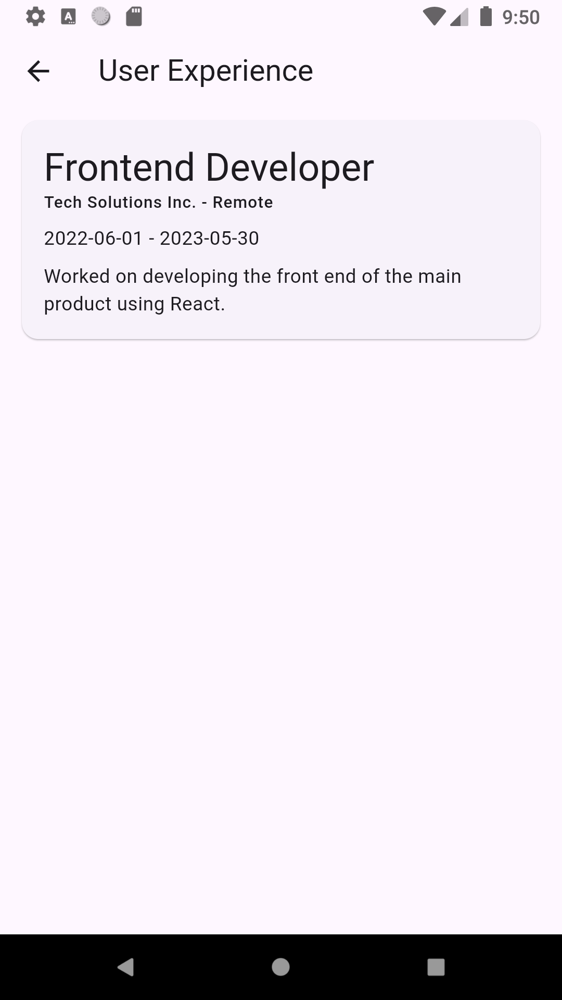
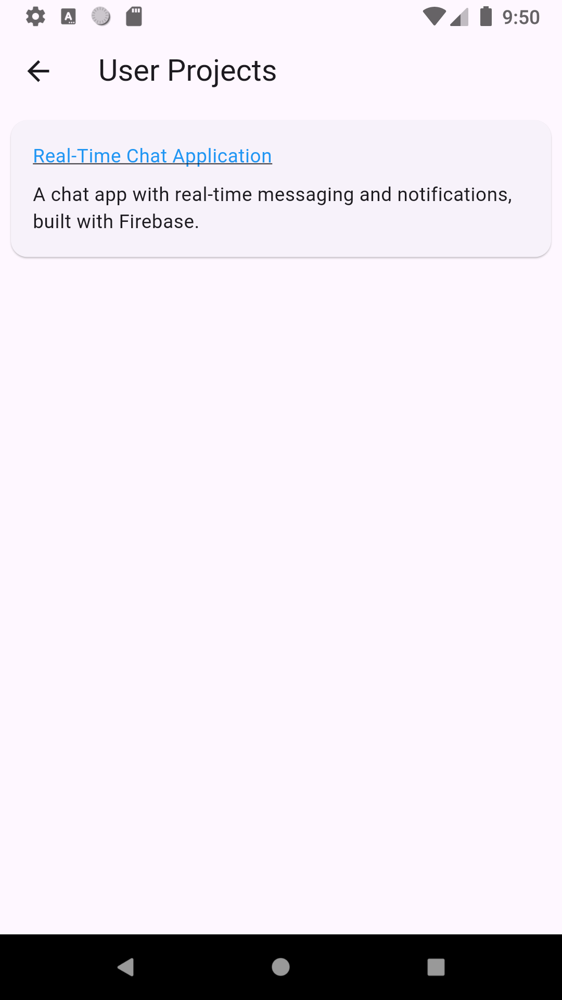
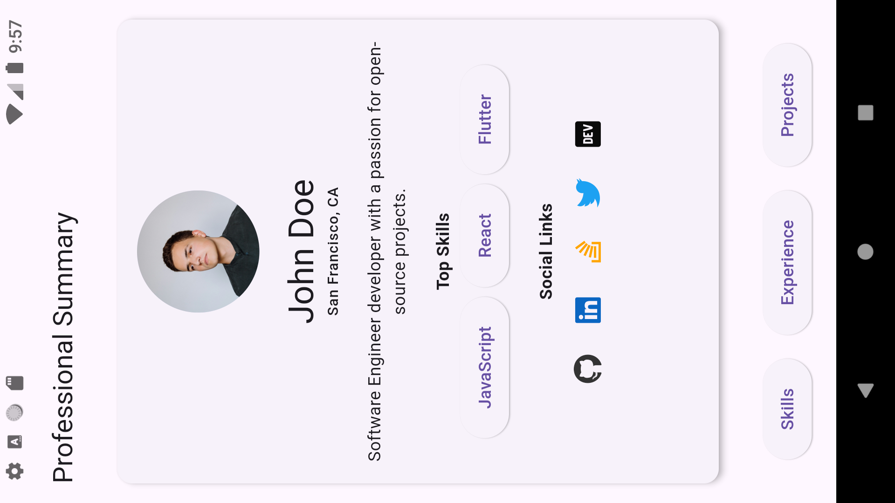

# Professional Summary App

This Flutter application showcases a developer's professional profile, including a professional summary, top skills, social links, experience, and projects.

## Screenshots

### Portrait Mode

1. **Professional Summary Screen**
   - Displays user's profile picture, name, location, bio, top skills, and social links.
   - Below the profile section, there are buttons to navigate to the user's Skills, Experience, and Projects.

   

2. **User Skills Screen**
   - Lists the user's skills with proficiency level and endorsement count.

   

3. **User Experience Screen**
   - Shows details of the user's work experience, including job title, company, date range, and job description.

   

4. **User Projects Screen**
   - Displays the user's projects with clickable titles that open the project link, if available.

   

### Landscape Mode

1. **Professional Summary Landscape**
   - The same profile information is displayed, adapted to the landscape orientation.

   

## Features

- **Profile Summary**: A comprehensive display of the user's basic information, including name, profile picture, location, and a brief bio.
- **Top Skills**: Showcases the user’s top skills in a visually appealing format.
- **Social Links**: Direct links to the user's profiles on various platforms such as GitHub, LinkedIn, Stack Overflow, Twitter, and Dev.to.
- **Navigation Buttons**: Allows users to navigate to sections for Skills, Experience, and Projects.
- **Details on Skills, Experience, and Projects**:
  - **Skills**: Displayed with proficiency and endorsement information.
  - **Experience**: Detailed information on the user's previous job roles.
  - **Projects**: Lists projects with descriptions and links to view them.

## Usage

1. Run the app in either portrait or landscape mode (restricted to portrait if set).
2. Navigate through the profile summary, skills, experience, and projects sections.
3. Click on social links or project links to access external resources.

## Setup

1. Clone the repository.
2. Install dependencies using `flutter pub get`.
3. Run the app on a connected device or emulator using `flutter run`.

## Notes

- This app is built using Flutter and is compatible with both iOS and Android.
- Portrait mode is recommended for the best user experience.

---

Feel free to customize this further as needed!
